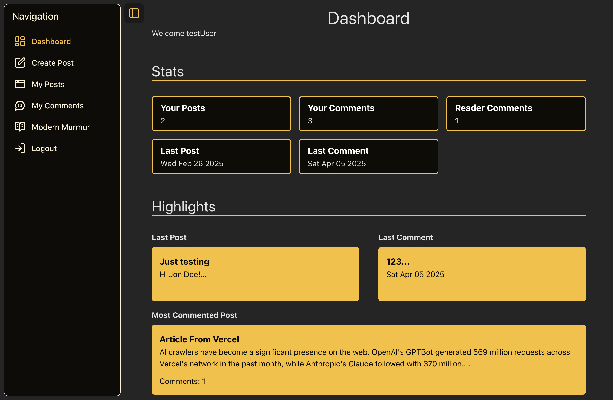
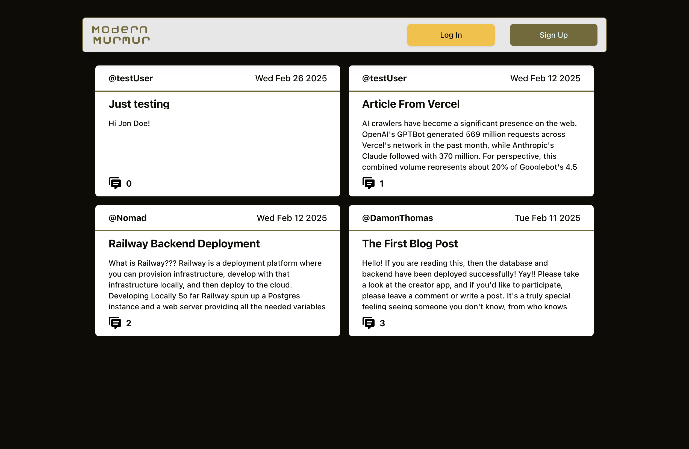
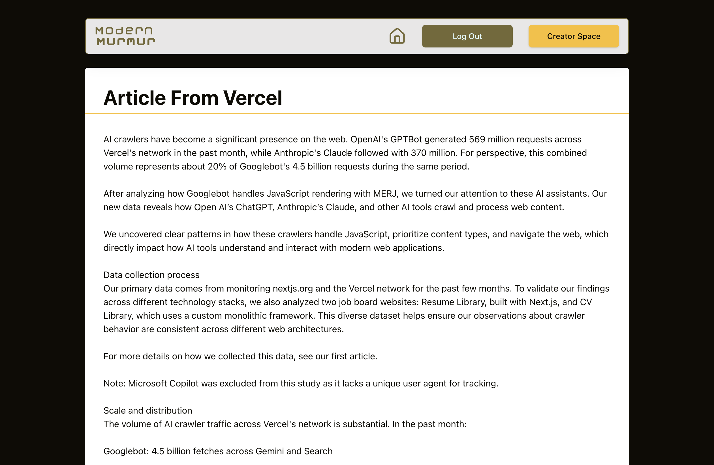

# blog-API

Blog API Project from The Odin Project => [Odin Assignment](https://www.theodinproject.com/lessons/node-path-nodejs-blog-api)

The project is made of 4 parts.

1. Backend RESTful API hosted on Railway
2. Postgres database that is managed by a Prisma ORM which is also hosted on Railway
3. Blog Viewer Application for viewing blog posts and making comments. Hosted on Vercel.
4. Creator Application for creating blog posts, managing posts, managing comments, and seeing user stats. Also hosted on Vercel.

The following was implemented/used to create the project:

- HTML, CSS, Javascript
- React, ReactRouter, Vite, Tailwind
- PostgreSQL, primsa
- Node.js, Typescript, Express.js
- JWT authentication, bcrypt
- Shadcn Components, Figma, Lucide Icons
- Railway, Vercel

# See Live Project => [Blog API](https://blog-api-green-mu.vercel.app/)

Test login info is pre-populated in the login form. Login and take a look at the Creator Application as well.

## Screenshots

  
  

  
  

